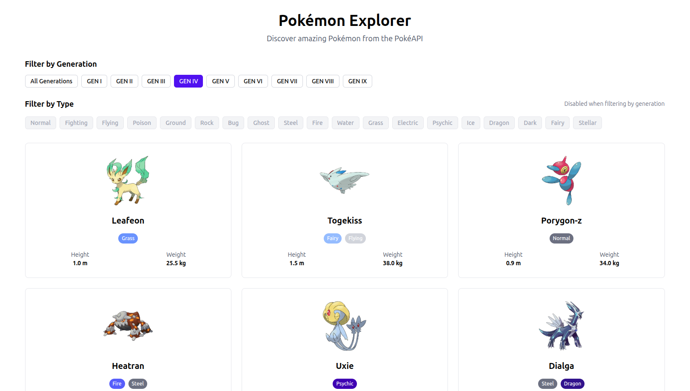

# Pokémon Explorer

Pokémon Explorer is a modern React.js application for discovering and exploring Pokémon using the PokéAPI. With type-based filtering, beautiful responsive cards, and detailed Pokémon stats, the app offers an interactive experience for browsing, searching, and learning about different Pokémon.

## Features

- Browse random Pokémon or filter by specific types
- View Pokémon details: stats, height, weight, and type information
- Responsive design with elegant card layouts
- Filter Pokémon by multiple types at once
- "Load more" functionality for extended browsing



## Getting Started

Install dependencies:

```bash
npm install
```

Run the development server:

```bash
npm run dev
```

Visit [http://localhost:5173](http://localhost:5173) in your browser to view the app.

Start editing by modifying `src/App.jsx`. Changes update automatically.

## Tech Stack

- **React 18** – UI framework
- **Vite** – Fast build tool & dev server
- **Tailwind CSS** – Utility-first styling
- **Lucide React** – Icon library
- **PokéAPI** – Pokémon data source

## Project Structure

```
src/
├── components/
│   ├── pokemon-card.jsx
│   └── type-selector.jsx
├── App.jsx           # Main application component
├── App.css           # Global styles
└── main.jsx          # React entry point
```

## Build & Preview

Build for production:

```bash
npm run build
```

Preview the production build locally:

```bash
npm run preview
```
